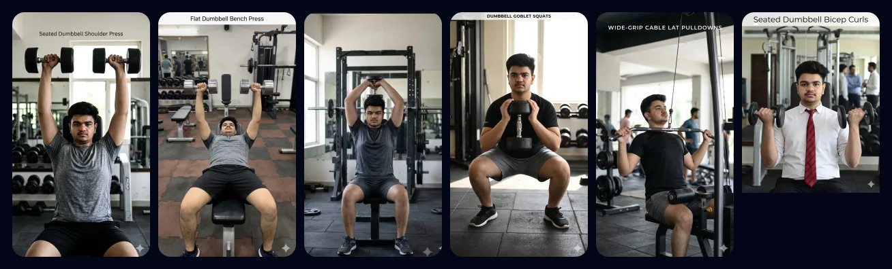

<div align="center">


# Gym with Lalu

**A personal, offline-first 6-day gym companion — built as an installable PWA.**

No backend · no accounts · no cloud. Everything lives on your device.

[](https://aarohrp-bit.github.io/gym_with_lalu)
&nbsp;

&nbsp;




</div>

---

## What is this?

**Gym with Lalu** is a workout companion for one or two people who train a fixed
**6-day split** (Sunday off). It’s deliberately small and opinionated: instead of logging
endless sets and reps, you swipe through a stack of exercise cards and aim to hit a handful
of **points** each day. It installs to your phone’s home screen, opens fullscreen, and works
**completely offline** at the gym.

> 🔗 **Try it:** **https://aarohrp-bit.github.io/gym_with_lalu**
> (open on your phone → "Add to Home Screen" to install it as an app)

### The core idea
- **6 training days + Sunday rest.** Each weekday maps to one muscle group:
  Shoulders · Chest · Triceps · Legs · Back · Biceps.
- **Hit your points target to finish the day** (5 by default, adjustable up to 10).
- **Two card types:**
  - **Type A** — a single exercise = **1 point**.
  - **Type B** — a timed circuit of 6 mini-exercises = **1 point**.
- **Everything is local.** Your data never leaves the phone; back it up or share it yourself.

---

## Features at a glance

| | Feature | What it does |
|---|---|---|
| 👤 | **Profiles + PIN** | Up to 3 profiles, each with a 4-digit soft-lock PIN, plus a no-tracking **Guest** mode. One profile can be the auto-loading **default**. |
| 🗓️ | **Smart weekly plan** | A fresh muscle-group→weekday layout each week, never repeating a group within 3 days of last week. |
| 🃏 | **Swipe-to-train cards** | Big photo cards. Swipe **right** to finish, **up/down** to browse, **double-tap** to flip to coaching + your last weight. |
| ⏱️ | **Timed circuits (Type B)** | Start a circuit, train along the countdown, and Finish when it hits zero. |
| 🛡️ | **Recovery lock** | A cooldown between completions so you can’t accidentally blow through a day. |
| 🌱 | **Seeds** | You and a friend type the same seed and get an identical week — deterministic on any device. |
| ✍️ | **Custom cards & circuits** | Build your own **exercises** (photo + how-to) or **Type-B circuits** (multi-move); share by **file, link, or QR**, and **scan a QR** to import. |
| ⭐ | **Pin favourites** | Star an exercise to pin it to the front of its category. |
| 💆 | **Rest-day check-in** | Log active recovery on Sunday to keep your streak alive. |
| 📊 | **Stats & streaks** | Workouts done, favourite focus, most/least-done exercise, and a day-streak badge. |
| 📤 | **Share your day** | Turn a finished day into an image to post or send. |
| 💾 | **Backup & share** | One-tap export/import of your whole profile or just your custom cards. |
| 🌗 | **Theme & feedback** | Dark by default with a clean light mode, plus optional **vibration** and **sound** cues. |
| 🛠️ | **Manage profile** | Rename a profile or change its PIN any time from Settings. |
| 📲 | **Installable + offline** | Full PWA: precaches the app and every image, so it runs in airplane mode. |

---

## How to use it

### 1 · Pick a profile
On launch you’ll see the **profile screen**:
- **Add profile** → enter a name and a 4-digit PIN (max 3 profiles per device).
- Tap a profile → enter its PIN to continue. *(3 wrong tries locks it for a cooldown.)*
- **Continue as Guest** → jump in with no long-term tracking.
- Tap the ⭐ on a profile to make it the **default** (it auto-loads next launch).

### 2 · The week dashboard
- The **7 day tiles** show this week’s muscle group per day, a status badge
  (**Pending** only on today, **Done**, or **Skipped**), and how many exercises are in play.
- **You can only train today’s day** — other days are locked, *unless* a seed is active or it’s
  Sunday (catch-up day).
- The header shows **“X of 6 days done”** and your 🔥 **streak**.
- Use **Enter seed** to sync a week with a friend, or **New week** to reshuffle.
- Top-right: **➕ make a custom card** and **⚙️ settings**.

### 3 · Do a workout
Tap today’s tile → read the short blurb → **Enter workout**. Then, on each card:

| Gesture | Action |
|---|---|
| 👉 **Swipe right** | Finish the exercise (+1 point) |
| 👆👇 **Swipe up / down** | Browse to other exercises you haven’t done |
| 👆👆 **Double-tap** | Flip the card → How to perform · What it does · **your last-weight note** · **⭐ pin** |

A **recovery lock** counts down between completions. Reach your points target and the day
locks with a **summary** (what you did + finish times) — tap **Share** there to post your day
as an image. Flip any card and tap the **star** to pin that exercise to the front next time.

On **Sunday**, tap the rest tile to **log active recovery** (walk / stretch / hydrate) and keep
your streak going.

### 4 · Circuits (Type B)
On the Chest and Biceps days one card is a **circuit**. Tap **Start** to open the timed
sub-window: swipe through the 6 mini-exercises while a countdown runs, **Abort** any time
(no penalty), and **Finish** once it reaches zero to claim the point. The phone buzzes when
the timer ends.

### 5 · Seeds (train together)
Open **Enter seed** on the dashboard and type any word/number. Anyone who types the **same
seed** gets the exact same week — same days, same card order. A seed lasts one week; clear it
or start a new week to go back to your personalized plan.

### 6 · Custom cards & circuits
Tap **➕** on the dashboard to **Make a card**, then pick **Exercise** or **Circuit**:
- **Exercise (Type A):** a **portrait ~9:16 photo** (off-ratio is rejected), a **name**,
  **how to perform**, **what it does**, and a **category**.
- **Circuit (Type B):** a name, a category, and **2–10 mini-moves** (each with a name, an
  optional how-to, and an optional photo) — it plays through the timed circuit runner.

It joins that category’s pool. **Edit** (✏️), **delete** (🗑️), or share it any time.

**Sharing a card three ways:**
- **📷 QR code** — tap the QR button on a card to show a code. A friend points their phone
  camera at it, the app opens, and it offers to add the card. *(QR cards travel as text —
  name + instructions + category — so they arrive without the photo; add one by editing.)*
- **🔗 Link** — copy or share the same deep link directly (e.g. paste into chat).
- **📄 File** — share a `.json` that **includes the photo**, for full-fidelity transfer.

### 7 · Settings
The ⚙️ menu lets you tune:
- **Recovery cooldown** and **circuit timer** length.
- **Workout size** — how many cards show per day and how many points finish it
  (max 10 each; points can never exceed cards shown).
- **Theme** (dark / light) with **vibration** and **sound** toggles.
- **Edit profile** — rename it or change its PIN.
- **Your data** — **Export Profile**, **Export Cards**, **Import** (auto-detects the file), or **Scan a card QR**.
- **Stats**, replay the **tutorial**, **delete profile** (PIN-protected), and **log out**.

### 8 · Install as an app / APK
- **On Android (Chrome/Brave):** open the live URL → menu → **Add to Home Screen**.
- **As a real APK:** feed the live URL into [PWABuilder](https://www.pwabuilder.com/) — the
  manifest and icons are set up for it.

---

## Run it locally

```bash
cd frontend
yarn install
yarn start      # dev server at http://localhost:3000
yarn build      # optimized production build → frontend/build
```

Deploy the static `frontend/build` to any host. This repo is wired for **GitHub Pages**:

```bash
yarn deploy     # builds and pushes to the gh-pages branch
```

> After one online load the app caches itself and works **fully offline** (airplane mode).

---

## Tech stack

- **React 19** + **react-router 7**
- **Tailwind CSS 3** (dark slate + indigo theme) with **framer-motion** gestures/animations
- **lucide-react** icons · **Barlow Condensed** + **DM Sans** fonts
- **qrcode** (generate) + **jsQR** (scan) for card QR sharing
- **Web Audio** for sound cues · **Canvas** for the shareable day image · **Vibration API** for haptics
- **localStorage** for all data — no backend
- Custom **service worker** (app-shell + image precache, offline-first)

---

## Project structure

```
frontend/
  public/
    exercises/          # exercise images (.webp, keyed by short id)
    manifest.json       # PWA manifest (dumbbell icon, standalone)
    service-worker.js   # app shell + image precache, offline-first fetch
    404.html            # SPA redirect for GitHub Pages deep links
  src/
    data/exercises.js     # exercise database (names, images, coaching text, circuits)
    data/categoryBlurbs.js
    lib/storage.js        # profiles, progress, counts, weeks, seeds, settings, custom cards,
                          # favourites, notes, lockouts, streak, export/import
    lib/weekgen.js        # deterministic RNG + seeded/random week generation
    lib/week.js           # Monday-based week bucketing
    lib/haptics.js        # vibration feedback
    lib/sound.js          # Web Audio beep / chime cues
    lib/share.js          # one-tap share (Web Share API) with download fallback
    lib/cardlink.js       # encode/decode a card into a QR-friendly deep link
    lib/theme.js          # light/dark theme application
    components/           # CircuitRunner, NoteField, QrScanner, StatusBadge
    pages/                # ProfileSelect, AddProfile, PinPad, Dashboard, DayDetail,
                          # Workout, Summary, Settings, Stats, CreateCard, Tutorial
docs/preview.webp       # README preview image
```

---

## The rules, in one place

- **Points** finish a day (default **5**, configurable up to 10). Type A = 1 pt, Type B circuit = 1 pt.
- **Cards shown per day** default to **8** (configurable up to 10); points can’t exceed cards shown.
- **Circuits** live on the Chest and Biceps days; the timer defaults to **10 minutes** (adjustable).
- **A recovery cooldown** sits between every completion.
- **Least-done-first** ordering nudges variety — switched off while a seed is active.
- **Non-seed weeks** never place a muscle group within 3 days of its previous-week slot.
- **You can only train today’s day** unless a seed is active or it’s Sunday.
- **All data is local** to the device — clearing site data wipes it; Guest history isn’t saved.

---

<div align="center">
<sub>Built for Lalu & friends 🏋️ · everything stays on your phone.</sub>
</div>
